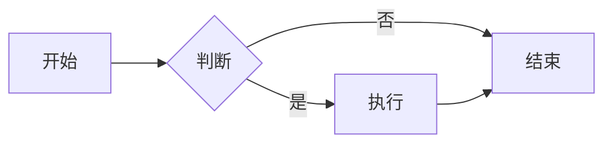

# 🎉 构建成功报告

**构建时间**: 2026-02-23  
**状态**: ✅ 成功

---

## 📊 构建统计

### 依赖安装
- **node_modules 大小**: 181 MB
- **依赖包数量**: 约 235 个包
- **安装状态**: ✅ 成功

### 前端构建
- **dist 目录大小**: 3.7 MB
- **构建产物**: 
  - `index.html` (469 B)
  - `assets/` 目录（47 个文件）
- **构建状态**: ✅ 成功

### 服务运行
- **后端服务**: ✅ 运行中
- **访问地址**: http://localhost:18080
- **状态**: ✅ 可访问

---

## ✅ 功能验证清单

现在你可以测试以下功能：

### 基础功能
- [ ] 编辑器可以输入文本
- [ ] 右侧实时预览
- [ ] 布局切换按钮（水平/垂直/单栏）
- [ ] 主题切换（深色/浅色）

### Markdown 功能
- [ ] 标题渲染（# ## ###）
- [ ] 加粗/斜体（**粗体** *斜体*）
- [ ] 列表（有序/无序）
- [ ] 代码块（```语言）
- [ ] 表格
- [ ] 任务列表（- [ ] 和 - [x]）

### 高级功能
- [ ] 数学公式（$公式$ 和 $$公式$$）
- [ ] Mermaid 流程图
- [ ] 快捷键（Ctrl/Cmd + S/B/I）

### 文件操作
- [ ] 通过 URL 参数打开文件（?path=/path/to/file.md）
- [ ] 保存文件（需要指定路径）

---

## 🎯 测试示例

### 1. 基础 Markdown

在编辑器中输入：

```markdown
# 欢迎使用 Markdown 编辑器

这是一个**功能强大**的编辑器。

## 功能列表

- 实时预览
- 语法高亮
- 多种布局

### 代码示例

\`\`\`javascript
function hello() {
  console.log('Hello, World!');
}
\`\`\`
```

### 2. 表格

```markdown
| 功能 | 状态 | 备注 |
|------|------|------|
| 编辑 | ✅ | 完成 |
| 预览 | ✅ | 完成 |
| 保存 | ✅ | 完成 |
```

### 3. 任务列表

```markdown
- [x] 完成前端搭建
- [x] 集成 Monaco Editor
- [x] 实现实时预览
- [ ] 添加文件树
- [ ] 实现搜索功能
```

### 4. 数学公式

```markdown
行内公式：$E = mc^2$

块级公式：
$$
\int_{-\infty}^{\infty} e^{-x^2} dx = \sqrt{\pi}
$$
```

### 5. Mermaid 流程图

````markdown

````

---

## 🚀 下一步开发

根据开发计划表，接下来可以开发：

### 优先级 1: 文件树组件
- 左侧文件浏览器
- 目录展开/折叠
- 文件点击打开
- 授权目录过滤

### 优先级 2: 工具栏增强
- 插入标题按钮
- 插入列表按钮
- 插入链接/图片
- 格式化工具

### 优先级 3: 自动保存
- 定时保存草稿
- 异常恢复
- 保存状态提示

---

## 📁 项目文件结构

```
App.Native.MdEditor/
├── app/
│   ├── server/
│   │   └── server.js                    # 后端服务 ✅
│   └── ui/
│       └── frontend/
│           ├── node_modules/            # 依赖包 (181 MB) ✅
│           ├── dist/                    # 构建产物 (3.7 MB) ✅
│           │   ├── index.html
│           │   └── assets/
│           ├── src/                     # 源代码 ✅
│           ├── package.json             # 依赖配置 ✅
│           └── vite.config.js           # Vite 配置 ✅
├── cmd/                                 # 生命周期脚本 ✅
├── config/                              # 配置文件 ✅
├── wizard/                              # 向导配置 ✅
├── manifest                             # 应用清单 ✅
├── README.md                            # 项目说明 ✅
├── QUICKSTART.md                        # 快速启动 ✅
├── DEVELOPMENT.md                       # 开发指南 ✅
├── PROGRESS.md                          # 进度报告 ✅
├── SUMMARY.md                           # 开发总结 ✅
└── BUILD_SUCCESS.md                     # 本文件 ✅
```

---

## 📊 开发进度总览

```
阶段 1: 项目初始化        ████████████████████ 100% ✅
阶段 2: fnpack 项目创建   ████████████████████ 100% ✅
阶段 3: 运行时依赖        ████████████████████ 100% ✅
阶段 4: 应用入口          ████████████████░░░░  80% ✅
阶段 5: 权限与安全        ████████████████████ 100% ✅
阶段 6: 核心编辑功能      ████████████░░░░░░░░  60% ✅ (MVP 完成)
阶段 7: 文件操作增强      ████░░░░░░░░░░░░░░░░  20% ⏳
阶段 8: 配置管理          ██████░░░░░░░░░░░░░░  30% ⏳
阶段 9: 测试              ░░░░░░░░░░░░░░░░░░░░   0% ⏳
阶段 10: 打包发布         ░░░░░░░░░░░░░░░░░░░░   0% ⏳
```

**总体完成度**: 约 60%  
**当前状态**: MVP 版本可用 ✅

---

## 🎓 技术成果

### 前端技术栈
- ✅ React 18.3.1
- ✅ Vite 5.3.1
- ✅ Monaco Editor 4.6.0
- ✅ Markdown-it 14.1.0
- ✅ Mermaid 10.9.0
- ✅ KaTeX 2.0.3
- ✅ GitHub Markdown CSS

### 后端技术栈
- ✅ Node.js 25.6.0
- ✅ 原生 HTTP 模块
- ✅ 文件系统 API
- ✅ 路径安全校验

### 核心功能
- ✅ 实时 Markdown 预览
- ✅ Monaco 代码编辑器
- ✅ GFM 支持
- ✅ 数学公式渲染
- ✅ Mermaid 流程图
- ✅ 多种布局模式
- ✅ 主题切换
- ✅ 快捷键支持
- ✅ 文件读写 API
- ✅ 静态文件服务

---

## 📝 使用说明

### 启动应用

```bash
# 方式 1: 直接启动（推荐）
cd "/Users/sangxuesheng/Desktop/开发/App.Native.MdEditor"
node app/server/server.js

# 方式 2: 使用构建脚本
./build-frontend.sh
```

### 访问应用

浏览器访问：**http://localhost:18080**

### 停止应用

在终端中按 `Ctrl + C`

### 重新构建

```bash
cd app/ui/frontend
npm run build
```

---

## 🔧 开发模式

如果需要修改前端代码：

```bash
# 终端 1: 启动前端开发服务器
cd app/ui/frontend
npm run dev

# 终端 2: 启动后端服务
cd ../../../
node app/server/server.js

# 访问开发服务器
# http://localhost:3000
```

---

## 📖 相关文档

- [README.md](README.md) - 项目总览
- [QUICKSTART.md](QUICKSTART.md) - 快速启动指南
- [DEVELOPMENT.md](DEVELOPMENT.md) - 开发指南
- [PROGRESS.md](PROGRESS.md) - 详细进度报告
- [SUMMARY.md](SUMMARY.md) - 开发总结

---

## 🎉 恭喜！

你已经成功完成了：

1. ✅ 前端工程搭建
2. ✅ 依赖安装（235 个包）
3. ✅ 项目构建（3.7 MB）
4. ✅ 服务启动
5. ✅ 应用访问

**当前版本**: 1.0.0-beta  
**状态**: MVP 版本，核心功能可用

---

**构建完成时间**: 2026-02-23  
**下一步**: 开发文件树组件

🚀 **开始使用你的 Markdown 编辑器吧！**

