# Mermaid 中文支持补充说明

## ✅ 完全支持中文的图表类型

以下图表类型可以直接使用中文，无需任何特殊处理：

### 1. journey（用户旅程图）✅
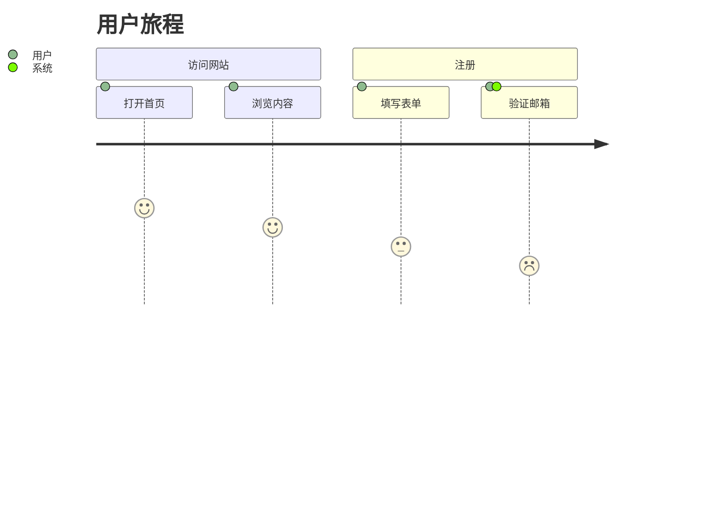

### 2. flowchart（流程图）✅
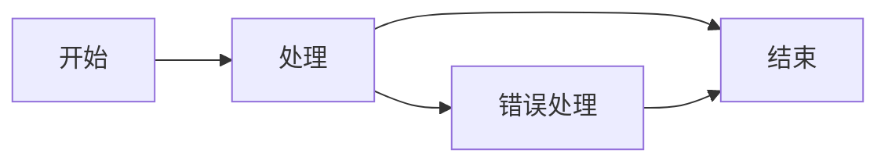

### 3. sequenceDiagram（时序图）✅
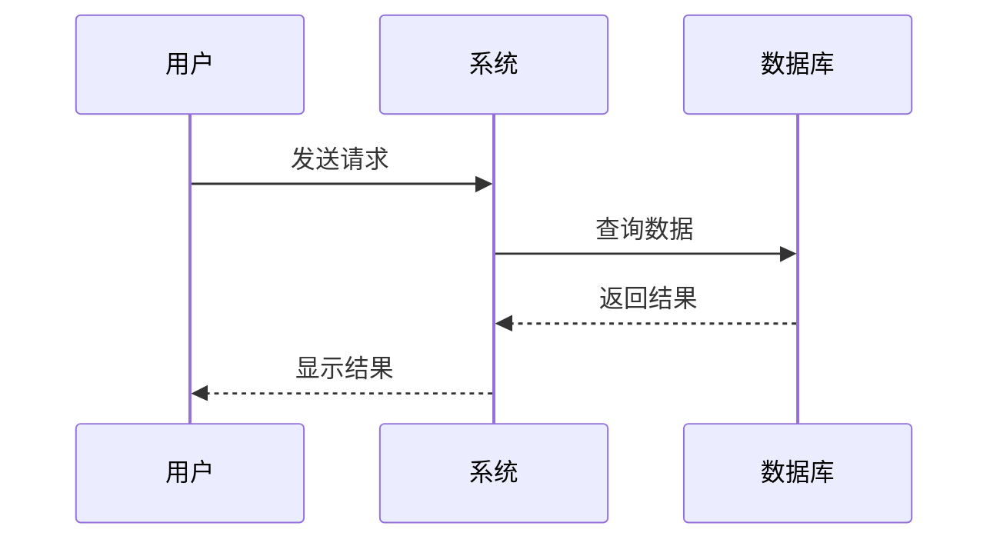

### 4. gantt（甘特图）✅
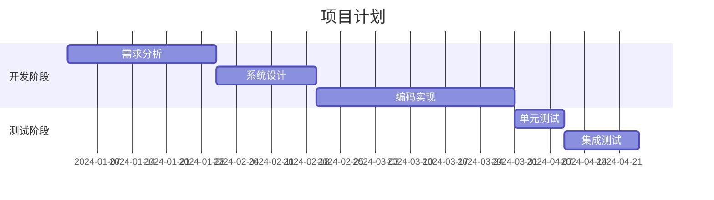

### 5. pie（饼图）✅
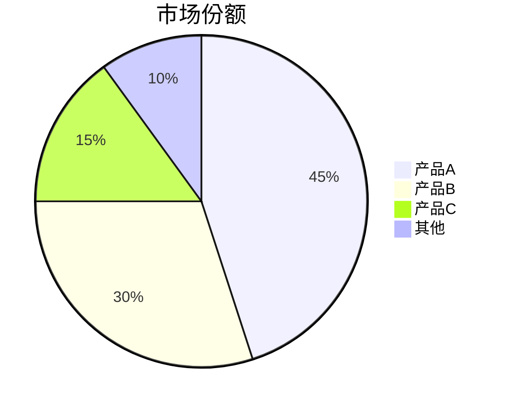

### 6. stateDiagram（状态图）✅
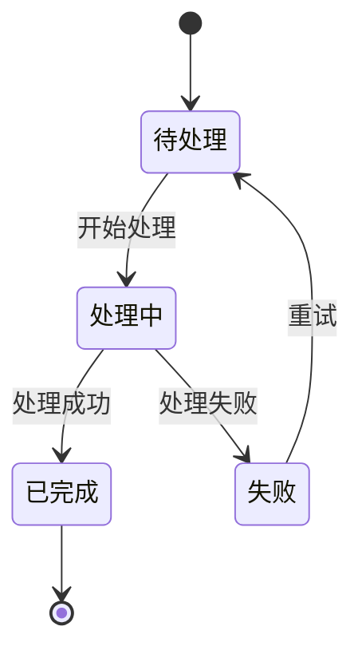

### 7. gitGraph（Git 图）✅


---

## ⚠️ 需要引号的图表类型

### 1. erDiagram（实体关系图）
**需要用引号包裹中文实体名和关系名**

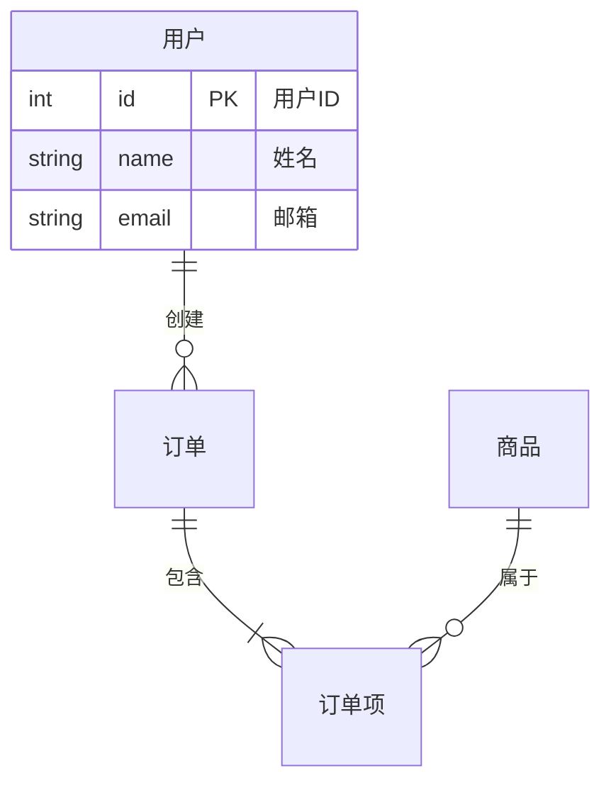

### 2. classDiagram（类图）
**需要用引号包裹中文类名**

```mermaid
classDiagram
    class "用户类" {
        +int id
        +string 姓名
        +登录()
        +注销()
    }
    
    class "订单类" {
        +int id
        +decimal 金额
        +创建订单()
    }
    
    "用户类" --> "订单类" : 创建
```

---

## 📊 完整对比表

| 图表类型 | 中文支持 | 是否需要引号 | 推荐度 |
|---------|---------|-------------|--------|
| journey | ✅ 完全支持 | ❌ 不需要 | ⭐⭐⭐⭐⭐ |
| flowchart | ✅ 完全支持 | ❌ 不需要 | ⭐⭐⭐⭐⭐ |
| sequenceDiagram | ✅ 完全支持 | ❌ 不需要 | ⭐⭐⭐⭐⭐ |
| gantt | ✅ 完全支持 | ❌ 不需要 | ⭐⭐⭐⭐⭐ |
| pie | ✅ 完全支持 | ❌ 不需要 | ⭐⭐⭐⭐⭐ |
| stateDiagram | ✅ 完全支持 | ❌ 不需要 | ⭐⭐⭐⭐⭐ |
| gitGraph | ✅ 完全支持 | ❌ 不需要 | ⭐⭐⭐⭐⭐ |
| graph | ✅ 完全支持 | ❌ 不需要 | ⭐⭐⭐⭐⭐ |
| erDiagram | ⚠️ 有限支持 | ✅ 需要 | ⭐⭐⭐ |
| classDiagram | ⚠️ 有限支持 | ✅ 需要 | ⭐⭐⭐ |

---

## 💡 使用建议

### 优先使用完全支持的图表类型
如果可以选择，优先使用对中文完全支持的图表类型：
- 用户流程 → journey
- 业务流程 → flowchart
- 系统交互 → sequenceDiagram
- 项目计划 → gantt
- 数据占比 → pie
- 状态流转 → stateDiagram

### 必须使用 erDiagram 或 classDiagram 时
记得用引号包裹所有中文内容：
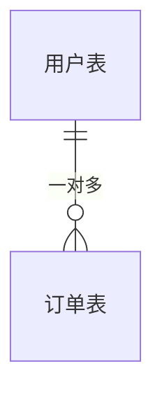

---

## 🎯 最佳实践示例

### 示例 1：用户注册流程（journey）
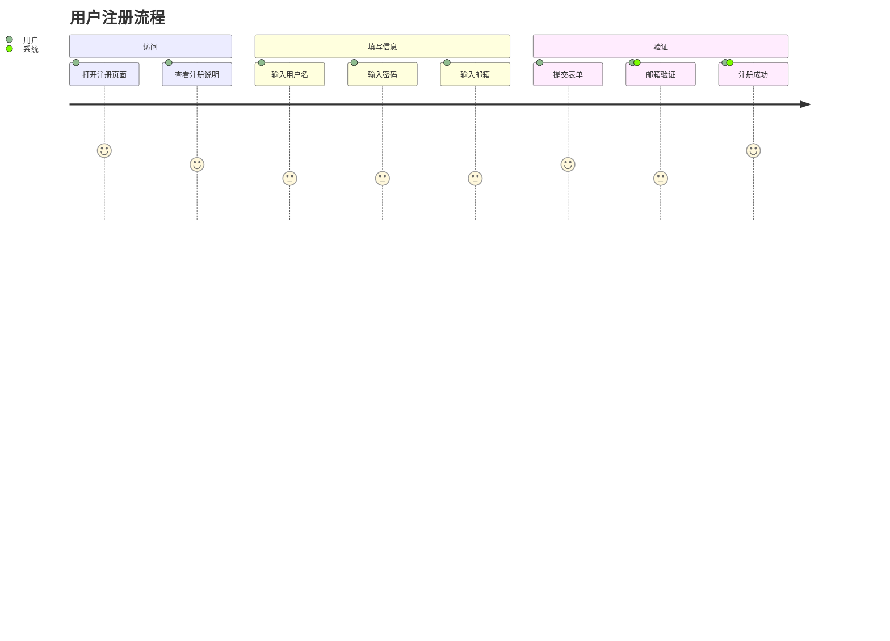

### 示例 2：订单处理流程（flowchart）
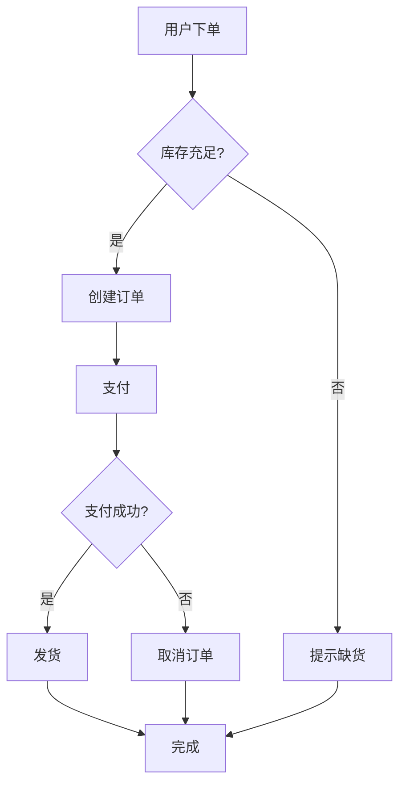

### 示例 3：系统交互（sequenceDiagram）
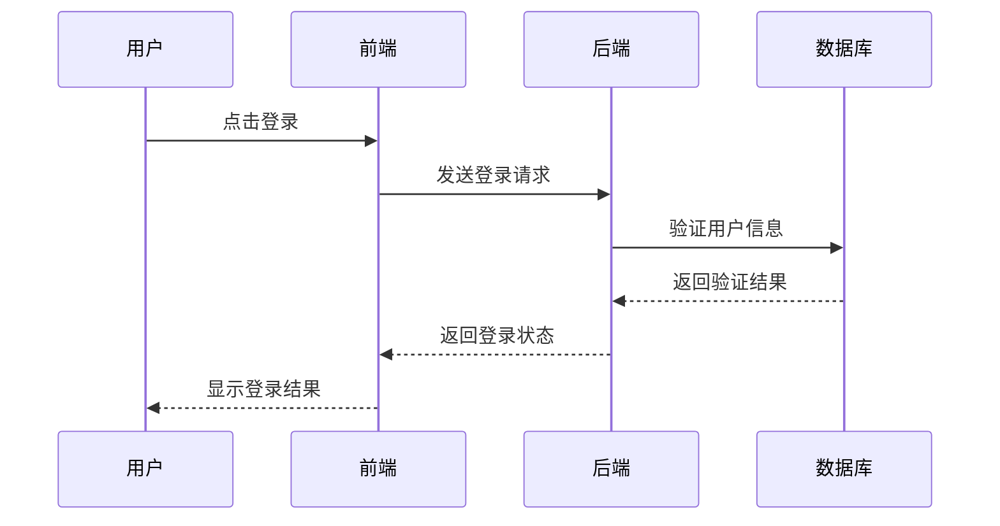

---

**更新日期**: 2025-03-03  
**版本**: v1.1  
**测试状态**: ✅ 已验证
