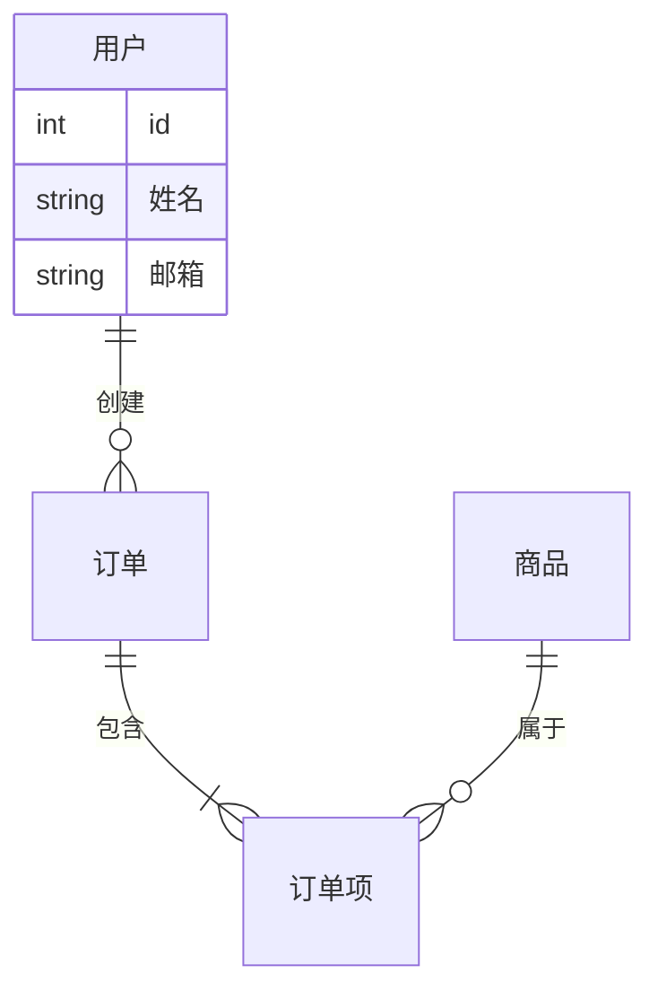
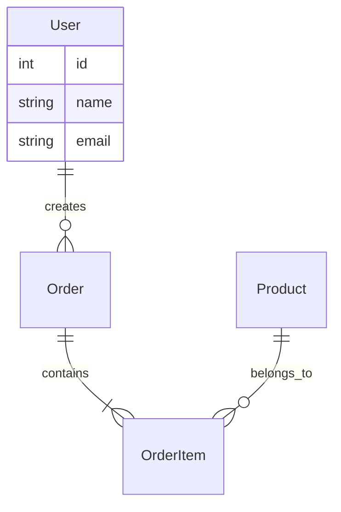
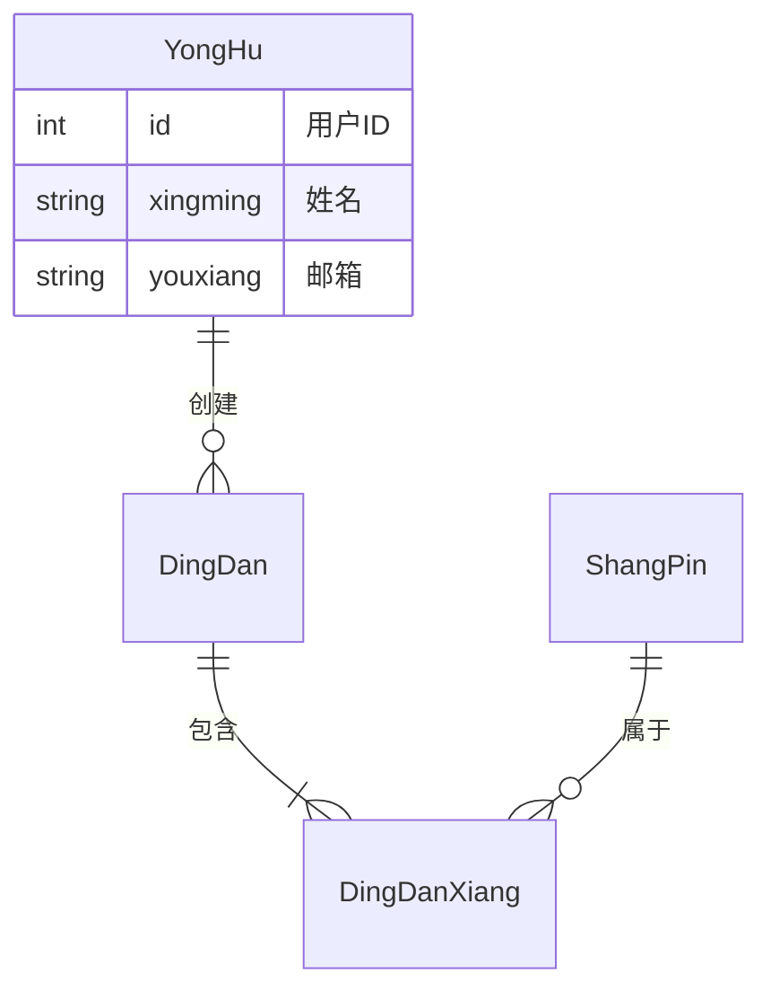
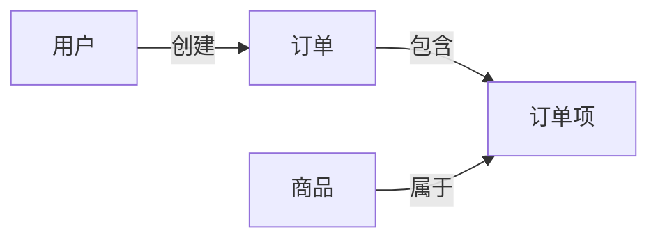
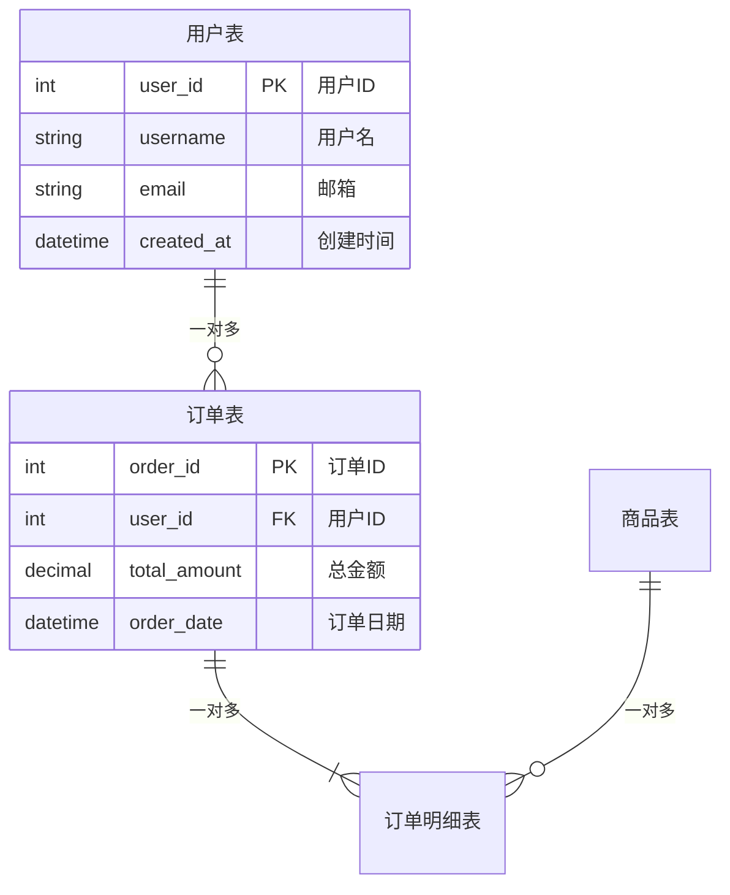
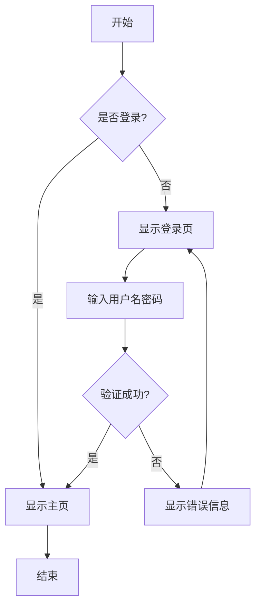

# Mermaid 中文支持说明

## 问题描述
Mermaid 图表在使用中文时可能出现渲染失败，特别是在 `erDiagram`（实体关系图）和 `classDiagram`（类图）中。

## 错误示例
```
Parse error on line 2:
erDiagram    用户 ||--o{ 订单 : 创建  
-------------^
Expecting 'EOF', 'SPACE', 'NEWLINE', 'title', 'acc_title', 'acc_descr', 
'acc_descr_multiline_value', 'ALPHANUM', 'ENTITY_NAME', got '用'
```

## 原因分析
1. Mermaid 的某些图表类型（如 erDiagram）对实体名称有严格的命名规则
2. 默认只支持字母、数字和下划线
3. 中文字符不被识别为有效的实体名称

## 解决方案

### 方案 1：使用引号包裹中文（推荐）


### 方案 2：使用英文或拼音命名


### 方案 3：使用拼音 + 中文注释


### 方案 4：改用 flowchart（流程图）
flowchart 对中文支持更好：



## 各图表类型中文支持情况

| 图表类型 | 中文支持 | 建议 | 示例 |
|---------|---------|------|------|
| flowchart | ✅ 完全支持 | 可直接使用中文 | `flowchart LR\n    开始 --> 结束` |
| graph | ✅ 完全支持 | 可直接使用中文 | `graph TD\n    A[开始] --> B[结束]` |
| sequenceDiagram | ✅ 完全支持 | 可直接使用中文 | `participant 用户` |
| gantt | ✅ 完全支持 | 可直接使用中文 | `section 开发阶段` |
| pie | ✅ 完全支持 | 可直接使用中文 | `"销售" : 45` |
| journey | ✅ 完全支持 | 可直接使用中文 | `title 用户旅程` |
| stateDiagram | ✅ 完全支持 | 可直接使用中文 | `[*] --> 开始` |
| erDiagram | ⚠️ 有限支持 | 需要用引号包裹 | `"用户" \|\|--o{ "订单"` |
| classDiagram | ⚠️ 有限支持 | 需要用引号包裹 | `class "用户类"` |
| gitGraph | ✅ 完全支持 | 可直接使用中文 | `commit id: "初始提交"` |

### 支持说明

#### ✅ 完全支持（推荐使用）
这些图表类型可以直接使用中文，无需任何特殊处理：
- flowchart / graph
- sequenceDiagram
- gantt
- pie
- journey
- stateDiagram
- gitGraph

#### ⚠️ 有限支持（需要引号）
这些图表类型在使用中文时需要用引号包裹：
- erDiagram（实体关系图）
- classDiagram（类图）

## 最佳实践

### 1. erDiagram 中文使用


### 2. classDiagram 中文使用
```mermaid
classDiagram
    class "用户类" {
        +int id
        +string 姓名
        +string 邮箱
        +创建订单()
        +查看订单()
    }
    
    class "订单类" {
        +int id
        +decimal 金额
        +datetime 日期
        +添加商品()
        +计算总额()
    }
    
    "用户类" --> "订单类" : 创建
```

### 3. flowchart 推荐用法


## 调试技巧

### 1. 检查语法
使用 [Mermaid Live Editor](https://mermaid.live/) 在线测试

### 2. 逐步添加内容
先测试基本结构，再逐步添加中文内容

### 3. 查看错误信息
编辑器会显示详细的错误信息和建议

### 4. 使用浏览器控制台
打开开发者工具查看详细错误日志

## 常见错误和解决

### 错误 1：实体名称包含中文
```
❌ 错误：
erDiagram
    用户 ||--o{ 订单 : 创建

✅ 正确：
erDiagram
    "用户" ||--o{ "订单" : "创建"
```

### 错误 2：属性名称包含中文
```
❌ 错误：
erDiagram
    User {
        int 用户ID
    }

✅ 正确：
erDiagram
    User {
        int user_id "用户ID"
    }
```

### 错误 3：关系标签包含中文
```
❌ 错误：
erDiagram
    User ||--o{ Order : 创建

✅ 正确：
erDiagram
    User ||--o{ Order : "创建"
```

## 编辑器增强建议

### 1. 添加错误提示
当检测到中文且渲染失败时，显示友好的错误提示和解决建议。

### 2. 自动转换
可以考虑添加预处理，自动为中文添加引号。

### 3. 模板库
提供常用的中文 Mermaid 模板。

## 参考资源

- [Mermaid 官方文档](https://mermaid.js.org/)
- [Mermaid Live Editor](https://mermaid.live/)
- [Mermaid GitHub](https://github.com/mermaid-js/mermaid)

---

**更新日期**: 2025-03-03  
**版本**: v1.0
