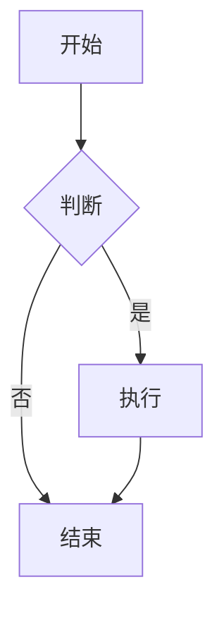

# 快速启动指南

## 🚀 5 分钟快速上手

### 前置条件

确保你的系统已安装：
- Node.js 18+ 
- npm 或 yarn

检查版本：
```bash
node --version  # 应该 >= 18.0.0
npm --version   # 应该 >= 9.0.0
```

---

## 方式一：开发模式（推荐用于开发）

### 步骤 1: 安装依赖

```bash
cd app/ui/frontend
npm install
```

等待依赖安装完成（首次约需 2-3 分钟）。

### 步骤 2: 启动前端开发服务器

```bash
npm run dev
```

你会看到：
```
VITE v5.3.1  ready in 500 ms

➜  Local:   http://localhost:3000/
➜  Network: use --host to expose
```

### 步骤 3: 启动后端服务

**打开新的终端窗口**，在项目根目录执行：

```bash
node app/server/server.js
```

你会看到：
```
App.Native.MdEditor backend listening on port 18080
Static files: /path/to/app/ui/frontend/dist
```

### 步骤 4: 访问应用

打开浏览器访问：**http://localhost:3000**

🎉 开始使用！

---

## 方式二：生产模式（推荐用于测试）

### 步骤 1: 构建前端

```bash
./build-frontend.sh
```

或手动构建：
```bash
cd app/ui/frontend
npm install
npm run build
```

### 步骤 2: 启动服务

```bash
node app/server/server.js
```

### 步骤 3: 访问应用

打开浏览器访问：**http://localhost:18080**

---

## 🎯 快速测试

### 测试 1: 编辑和预览

1. 在编辑器中输入：
```markdown
# Hello Markdown

这是一个**测试**文档。

- 列表项 1
- 列表项 2
```

2. 右侧预览区会实时显示渲染结果

### 测试 2: 切换布局

点击顶部工具栏的布局按钮：
- 📊 水平布局（上下分屏）
- 📊 垂直布局（左右分屏）
- 📝 仅编辑器
- 👁️ 仅预览

### 测试 3: 主题切换

点击顶部的 🌙/☀️ 按钮切换深色/浅色主题。

### 测试 4: 快捷键

- 选中文本后按 `Ctrl/Cmd + B` → 加粗
- 选中文本后按 `Ctrl/Cmd + I` → 斜体
- 按 `Ctrl/Cmd + S` → 保存（需要指定文件路径）

### 测试 5: 高级功能

#### 表格
```markdown
| 功能 | 状态 |
|------|------|
| 编辑 | ✅ |
| 预览 | ✅ |
```

#### 任务列表
```markdown
- [x] 已完成任务
- [ ] 待办任务
```

#### 数学公式
```markdown
行内公式：$E = mc^2$

块级公式：
$$
\int_{-\infty}^{\infty} e^{-x^2} dx = \sqrt{\pi}
$$
```

#### Mermaid 流程图
````markdown

````

---

## 🔧 常见问题

### Q1: npm install 失败

**解决方案**：
```bash
# 清除缓存
npm cache clean --force

# 删除 node_modules
rm -rf node_modules package-lock.json

# 重新安装
npm install
```

### Q2: 端口被占用

**错误信息**：`Error: listen EADDRINUSE: address already in use :::18080`

**解决方案**：
```bash
# 查找占用端口的进程
lsof -i :18080

# 杀死进程
kill -9 <PID>

# 或者修改端口
PORT=8080 node app/server/server.js
```

### Q3: 前端开发服务器无法连接后端

**检查**：
1. 后端服务是否在运行？
2. 后端端口是否为 18080？
3. 检查 `vite.config.js` 中的 proxy 配置

### Q4: 构建后访问 404

**检查**：
1. `dist` 目录是否存在？
2. `dist/index.html` 是否存在？
3. 后端服务是否正确启动？

---

## 📝 开发工作流

### 日常开发

1. **启动开发环境**
```bash
# 终端 1: 前端
cd app/ui/frontend && npm run dev

# 终端 2: 后端
node app/server/server.js
```

2. **修改代码**
   - 前端代码修改后自动热重载
   - 后端代码修改后需要重启服务

3. **测试功能**
   - 在浏览器中测试
   - 检查控制台错误

4. **提交代码**
```bash
git add .
git commit -m "feat: 添加新功能"
```

### 发布前检查

1. **构建生产版本**
```bash
./build-frontend.sh
```

2. **测试生产版本**
```bash
node app/server/server.js
# 访问 http://localhost:18080
```

3. **检查功能**
   - [ ] 所有页面正常加载
   - [ ] 编辑器正常工作
   - [ ] 预览正常渲染
   - [ ] 快捷键正常
   - [ ] 主题切换正常
   - [ ] 布局切换正常

4. **打包 fpk**
```bash
fnpack build
```

---

## 🎓 下一步

- 阅读 [开发指南](DEVELOPMENT.md) 了解详细开发流程
- 查看 [进度报告](PROGRESS.md) 了解当前开发状态
- 参考 [开发计划表](../开发计划表.md) 了解后续计划

---

## 💡 提示

- **开发模式**：前端热重载，方便调试
- **生产模式**：性能优化，接近真实环境
- **推荐编辑器**：VS Code + Volar 插件
- **推荐浏览器**：Chrome/Edge（开发者工具强大）

---

**祝你开发愉快！** 🎉

