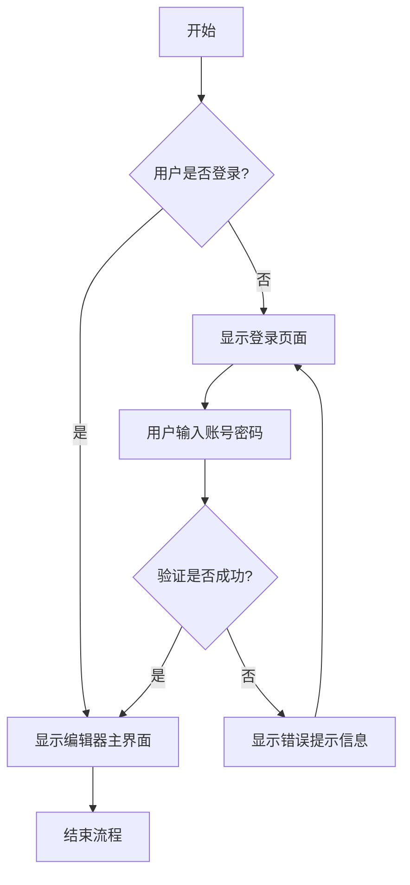
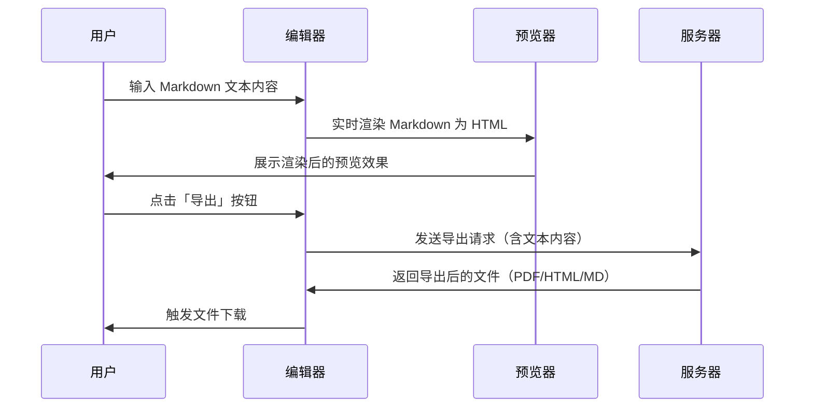

- [ ] # Markdown 编辑器功能展示
这是一个完整的 Markdown 功能展示文档，包含了各种常用的格式和元素，可直观呈现编辑器的核心能力。
# 
- [ ] [``````

```

```](https://)- # ******
## 文本格式
### 基础文本样式
- **粗体文本**
- *斜体文本*
- ***粗斜体文本***
- ~~删除线文本~~
- `行内代码（单行代码片段）`

### 标题层级
# 一级标题
## 二级标题
### 三级标题
#### 四级标题
##### 五级标题
###### 六级标题

## 列表
### 无序列表
- 第一项
- 第二项
  - 嵌套项目 1
  - 嵌套项目 2
- 第三项

### 有序列表
1. 第一步
2. 第二步
   1. 子步骤 A
   2. 子步骤 B
3. 第三步

### 任务列表
- [x] 已完成的任务
- [ ] 待完成的任务
- [ ] 另一个待完成的任务

## 链接和图片
### 链接
[这是一个普通链接](https://example.com)  
[带标题的链接](https://example.com "示例链接的标题说明")

### 图片


## 引用
> 这是一个基础引用块
>
> 引用块可以包含多行内容，换行需保留换行符
>
> > 这是嵌套引用（二级引用）
> >
> > 嵌套引用常用于补充说明或引用嵌套场景

## 代码块
### JavaScript 代码
```javascript
// 简单的问候函数示例
function greet(name) {
    console.log(`Hello, ${name}!`);
    return `Welcome to Markdown Editor`;
}

// 调用函数并输出结果
const message = greet('用户');
console.log(message);
```

### Python 代码
```python
# 计算斐波那契数列的递归函数
def calculate_fibonacci(n):
    if n <= 1:
        return n
    return calculate_fibonacci(n-1) + calculate_fibonacci(n-2)

# 计算并打印前10个斐波那契数
for i in range(10):
    print(f"F({i}) = {calculate_fibonacci(i)}")
```

### CSS 代码
```css
/* Markdown 编辑器基础样式 */
.markdown-editor {
    font-family: 'Helvetica Neue', Arial, sans-serif;
    line-height: 1.6;
    color: #333;
    max-width: 1200px;
    margin: 0 auto;
    padding: 20px;
}

/* 代码块样式优化 */
.code-block {
    background-color: #f4f4f4;
    border-radius: 4px;
    padding: 1rem;
    overflow-x: auto;
    font-family: 'Consolas', 'Monaco', monospace;
}
```

## 表格
| 功能       | 描述                 | 状态      |
|------------|----------------------|-----------|
| 实时预览   | 编辑内容实时渲染预览 | ✅ 已实现 |
| 语法高亮   | 代码块语法彩色高亮   | ✅ 已实现 |
| 导出功能   | 支持多种格式导出     | ✅ 已实现 |
| 主题切换   | 多种界面主题可选     | ✅ 开发中 |
| 插件系统   | 扩展功能插件支持     | 🚧 计划中 |

## 数学公式
### 行内公式
# 这是���个行内公式：$E = mc^2$（爱因斯坦质能方程）  
另一个行内公式：$\sum_{i=1}^n i = \frac{n(n+1)}{2}$（自然数求和公式）

### 块级公式
$$
\int_{-\infty}^{\infty} e^{-x^2} dx = \sqrt{\pi}
$$

$$
\begin{align}
\nabla \times \vec{\mathbf{B}} -\, \frac1c\, \frac{\partial\vec{\mathbf{E}}}{\partial t} &= \frac{4\pi}{c}\vec{\mathbf{j}} \\
\nabla \cdot \vec{\mathbf{E}} &= 4 \pi \rho \\
\nabla \times \vec{\mathbf{E}}\, +\, \frac1c\, \frac{\partial\vec{\mathbf{B}}}{\partial t} &= \vec{\mathbf{0}} \\
\nabla \cdot \vec{\mathbf{B}} &= 0
\end{align}
$$

## 流程图 (Mermaid)


## 时序图


## 分隔线
---

## 特殊符号和 Emoji
### 常用符号
- © 版权符号 (Copyright)
- ® 注册商标符号 (Registered Trademark)
- ™ 商标符号 (Trademark)
- § 章节符号 (Section)
- ¶ 段落符号 (Paragraph)
```
```

```
```
### Emoji 表情
- 😀 开心 | 🚀 火箭（进度/发布） | 💡 想法（灵感）
- ⭐ 星星（收藏/重点） | 🎉 庆祝（完成/发布） | 📝 笔记（编辑）
- 💻 电脑（开发/编程） | 🔧 工具（设置/配置） | ✅ 完成 | 🚧 开发中

## 脚注
这是一个带脚注的文本[^1]，适合补充说明不影响正文阅读的内容，还有另一个脚注[^2]。

[^1]: 这是第一个脚注的详细内容，可以包含多行文本、链接甚至简单格式
[^2]: 这是第二个脚注的内容，脚注会自动出现在文档末尾，便于查阅

## 高亮文本
==这是高亮文本==（常用于重点标注、提醒注意的内容）  
在编辑文档时，==关键信息、重要提示==都可以用高亮突出

## 键盘按键
按 <kbd>Ctrl</kbd> + <kbd>S</kbd> 保存文档  
按 <kbd>Ctrl</kbd> + <kbd>C</kbd> 复制选中内容  
按 <kbd>Ctrl</kbd> + <kbd>Z</kbd> 撤销上一步操作  
按 <kbd>Shift</kbd> + <kbd>Enter</kbd> 换行不换段

## 缩写
HTML 是 *HyperText Markup Language*（超文本标记语言）的缩写  
CSS 是 *Cascading Style Sheets*（层叠样式表）的缩写  
Markdown 本身没有官方缩写，是一种轻量级标记语言

## 定义列表
Markdown
:   一种轻量级标记语言，专注于易读易写，最终可转换为 HTML
:   核心特点：语法简单、无格式干扰、跨平台兼容

HTML
:   超文本标记语言，用于创建网页的标准标记语言
:   与 Markdown 的关系：Markdown 是 HTML 的简化版，最终渲染为 HTML

CSS
:   层叠样式表，用于描述 HTML 文档的呈现样式
:   常与 Markdown 编辑器配合，美化渲染后的内容

## 总结
这个 Markdown 文档全面展示了编辑器支持的核心功能，覆盖八大类场景：
1. **文本格式化** - 粗体、斜体、删除线、行内代码等基础样式
2. **结构化内容** - 标题、列表（无序/有序/任务）、表格、定义列表
3. **媒体内容** - 普通链接、带标题链接、图片（带描述）
4. **代码展示** - 多语言代码块、语法高亮、代码注释
5. **数学公式** - 行内/块级 LaTeX 公式，支持复杂公式排版
6. **图表绘制** - Mermaid 流程图、时序图（无需外部图片）
7. **交互/补充元素** - 任务列表、脚注、键盘按键、缩写
8. **特殊格式** - 引用（嵌套）、分隔线、高亮文本

---

**版权声明**：本文档仅用于 Markdown 编辑器功能展示，无版权限制，欢迎自由使用、修改和分发。

---

### 编辑器使用��示
点击工具栏的「新建」按钮创建新文件，或从左侧文件树打开现有文件。  
开始编辑吧！体验 Markdown 带来的简洁高效写作方式 