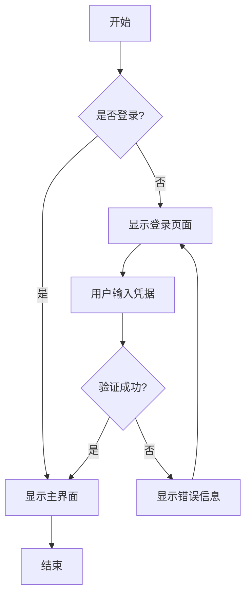

# 导出功能测试指南

## ✅ 部署状态
- 应用版本: 1.27.7
- 运行状态: running
- 健康检查: ✅ 通过
- 访问地址: http://192.168.2.2:18080/

## 🧪 测试步骤

### 1. 准备测试文档

打开应用后，创建一个包含以下内容的测试文档：

```markdown
# 导出功能测试文档

## 1. 表格测试

| 姓名 | 邮箱 | 编号 |
|------|------|------|
| yanglbme | contact@yanglibin.info | YLB0109 |
| YangFong | yangfong2022@gmail.com | yq2419731931 |
| thinkasany | thinkasany@gmail.com | thinkasany |

## 2. Mermaid 流程图测试



## 3. 数学公式测试

行内公式：$E = mc^2$

块级公式：
$$
\int_{-\infty}^{\infty} e^{-x^2} dx = \sqrt{\pi}
$$

## 4. 图片测试


## 5. 代码块测试

```javascript
function hello() {
    console.log("Hello, World!");
    return true;
}
```
```

### 2. 测试导出功能

#### 测试 HTML 导出
1. 点击"导出"按钮
2. 选择"HTML"格式
3. 点击"导出"
4. 检查下载的 HTML 文件

**预期结果**：
- ✅ 表格正确显示
- ✅ Mermaid 图表显示为 SVG
- ✅ 数学公式正确渲染
- ✅ 图片正常显示
- ✅ 代码块有语法高亮

#### 测试 PDF 导出
1. 点击"导出"按钮
2. 选择"PDF"格式
3. 点击"导出"
4. 在打印对话框中选择"另存为 PDF"

**预期结果**：
- ✅ 打开打印预览窗口
- ✅ 内容完整显示
- ✅ 可以保存为 PDF

#### 测试 PNG 导出
1. 点击"导出"按钮
2. 选择"PNG 图片"格式
3. 点击"导出"
4. 等待图片生成

**预期结果**：
- ✅ 显示"正在生成图片..."
- ✅ 自动下载 PNG 文件
- ✅ 图片内容完整清晰

### 3. 检查浏览器控制台

按 F12 打开开发者工具，切换到 Console 标签：

**成功的日志示例**：
```
=== 导出 HTML 调试信息 ===
exportConfig: {theme: 'default', ...}
previewHtml 长度: 12345
找到 export-config-styles 元素: true
主题样式长度: 5678
=== 调试信息结束 ===
```

**失败的日志示例**：
```
=== 导出错误 ===
previewHtml 为空，无法导出
```

或者：
```
[微信导出] previewRef.current 不存在，返回原始 HTML
```

## 🐛 故障排查

### 问题 1: 导出的 HTML 为空

**可能原因**：
- 预览区没有正确渲染
- previewRef.current 为 null

**解决方法**：
1. 检查预览区是否显示内容
2. 切换到"仅预览"模式，确认内容完整
3. 查看控制台是否有错误信息
4. 刷新页面重试

### 问题 2: 表格或图表不显示

**可能原因**：
- CSS 资源加载失败
- Mermaid 未正确渲染

**解决方法**：
1. 打开 Network 标签，检查资源加载
2. 确认 github-markdown-css 加载成功
3. 确认 highlight.js CSS 加载成功
4. 检查 Mermaid 是否有错误

### 问题 3: 数学公式显示为代码

**可能原因**：
- KaTeX 未加载
- MathJax 未加载

**解决方法**：
1. 检查 Network 标签
2. 确认 katex.min.css 加载成功
3. 确认 MathJax 脚本加载成功

## 📊 测试结果记录

| 功能 | 状态 | 备注 |
|------|------|------|
| HTML 导出 - 表格 | ⬜ | |
| HTML 导出 - 图表 | ⬜ | |
| HTML 导出 - 公式 | ⬜ | |
| HTML 导出 - 图片 | ⬜ | |
| PDF 导出 | ⬜ | |
| PNG 导出 | ⬜ | |
| 微信格式复制 | ⬜ | |

**图例**：
- ✅ 通过
- ❌ 失败
- ⬜ 未测试

## 📝 测试报告模板

```
测试时间: ____________________
测试人员: ____________________
应用版本: 1.27.7

测试结果：
1. HTML 导出: [ ] 通过 [ ] 失败
   - 表格: [ ] 正常 [ ] 异常
   - 图表: [ ] 正常 [ ] 异常
   - 公式: [ ] 正常 [ ] 异常
   - 图片: [ ] 正常 [ ] 异常

2. PDF 导出: [ ] 通过 [ ] 失败

3. PNG 导出: [ ] 通过 [ ] 失败

问题描述（如有）：
_________________________________
_________________________________
_________________________________

控制台错误信息（如有）：
_________________________________
_________________________________
_________________________________
```

## 🎯 成功标准

所有以下条件都满足，则认为修复成功：

✅ HTML 导出包含完整内容（表格、图表、公式、图片）
✅ PDF 导出可以正常打开打印对话框
✅ PNG 导出生成清晰的图片
✅ 浏览器控制台没有红色错误信息
✅ 导出的文件可以正常打开和查看

## 📞 反馈

如果测试中发现问题，请提供：
1. 浏览器控制台的完整错误信息
2. Network 标签中失败的请求
3. 导出的文件（如果有）
4. 测试文档的内容

